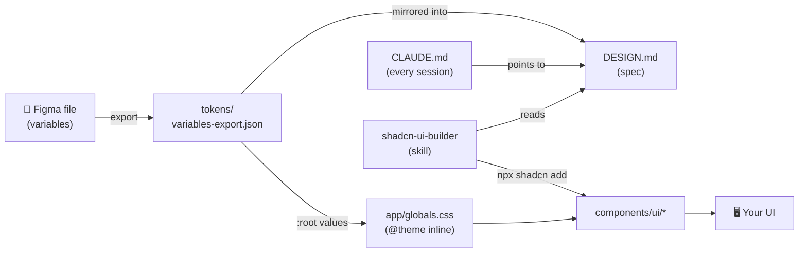

<div align="center">

# 🎨 shadcn-skill-design-starter

**Next.js starter wired for AI-assisted UI development** —
real Figma design tokens, a Claude Code skill, and shadcn/ui working as one system.

[](https://nextjs.org)
[](https://react.dev)
[](https://tailwindcss.com)
[](https://ui.shadcn.com)
[](https://www.typescriptlang.org)
[](https://claude.com/claude-code)

</div>

---

## ✨ What is this?

A production-ready starter where **the design system is enforced, not just documented**:

- 🧬 **1,807 design tokens** exported straight from Figma (`tokens/variables-export.json`) — the single source of truth
- 🤖 **Claude Code integration** — `CLAUDE.md` loads every session; the `shadcn-ui-builder` skill kicks in automatically on any UI task
- 📐 **`DESIGN.md` spec** — every color, radius, font size, and spacing rule mirrors the Figma export 1:1 (verified by script)
- 🧱 **shadcn/ui (radix-nova)** on **Tailwind CSS v4** — no `tailwind.config`, theme lives in CSS via `@theme inline`
- 🇹🇭 **Thai-first typography** — GraphikTH + IBM Plex Sans Thai, loaded with `next/font`

## 🚀 Quick start

```bash
git clone https://github.com/Zippawich/shadcn-skill-design-starter.git
cd shadcn-skill-design-starter
npm install
npm run dev          # → http://localhost:3000
```

Open the folder with **Claude Code** and just ask for UI:

> "สร้างหน้า dashboard ที่มี sidebar และตาราง" — the skill triggers, reads `DESIGN.md`, and builds with the project's real tokens.

## 📦 Project structure

```
├── CLAUDE.md                       # Claude Code memory — rules, commands, Figma workflow
├── DESIGN.md                       # Design system spec (mirrors the Figma export)
├── tokens/
│   └── variables-export.json       # 🔒 Figma variables export — source of truth
├── .claude/
│   └── skills/
│       └── shadcn-ui-builder/
│           └── SKILL.md            # UI workflow skill (auto-triggers on UI tasks)
├── app/
│   ├── globals.css                 # Tailwind v4 theme — :root = Figma tokens (light only)
│   ├── layout.tsx                  # Fonts: GraphikTH + IBM Plex Sans Thai
│   └── page.tsx
├── components/ui/                  # shadcn components (added via CLI, owned source)
├── lib/utils.ts                    # cn() helper
└── components.json                 # shadcn config — radix-nova / neutral / lucide
```

## 🎯 How the pieces fit



**Token sync loop** — when design changes in Figma:

1. Design team re-exports variables → replace `tokens/variables-export.json`
2. Ask Claude: *"sync tokens"* → it updates `DESIGN.md` §3–§5 and `:root` in `globals.css`
3. Every hex value is verified against the JSON before the task is considered done

## 🎨 Design system at a glance

| | |
|---|---|
| **Base palette** | Neutral (Tailwind) · charts use a Radix blue ramp |
| **Primary** | `#171717` · **Destructive** `#dc2626` · **Border** `#e5e5e5` |
| **Radius** | Fixed steps `2 / 4 / 6 / 8 / 12 / 16 / 24 / 32 px` (base = 8px) |
| **Fonts** | GraphikTH → IBM Plex Sans Thai → system (Thai-safe stack) |
| **Mode** | ☀️ **Light only** — dark tokens not designed yet (no `dark:` allowed) |

Hard rules (enforced by `CLAUDE.md` + skill):

- ✅ `bg-primary text-primary-foreground` &nbsp;·&nbsp; ❌ `bg-neutral-900 text-white`
- ✅ `npx shadcn@latest add button` &nbsp;·&nbsp; ❌ pasting component code from memory
- ✅ Change colors in **Figma → re-export → sync** &nbsp;·&nbsp; ❌ editing token values in CSS

## 🛠️ Commands

| Command | Purpose |
|---|---|
| `npm run dev` | Dev server (Turbopack) |
| `npm run build` | Production build |
| `npm run lint` | ESLint |
| `npx tsc --noEmit` | Type check |
| `npx shadcn@latest add <name>` | Add a shadcn component |

## 🗺️ Status & roadmap

- [x] Next.js 16 + Tailwind v4 + shadcn/ui scaffold
- [x] Figma tokens wired into `globals.css` (35/35 verified)
- [x] Claude Code memory + skill
- [ ] GraphikTH font files (`next/font/local`) — referenced by family name until available
- [ ] Figma file URL in `CLAUDE.md` (placeholder)
- [ ] Dark mode — waiting for dark tokens from the design team
- [ ] `--destructive-foreground` & `--radius` tokens in Figma (interim values in use, see `DESIGN.md` §5)

---

<div align="center">

Built with [Claude Code](https://claude.com/claude-code) · Spec in [`DESIGN.md`](./DESIGN.md) · Workflow in [`.claude/skills/shadcn-ui-builder/SKILL.md`](./.claude/skills/shadcn-ui-builder/SKILL.md)

</div>
